# Cloudflare Workers Task Queue System

A scalable, distributed task processing system built with **Hono.js**, **Cloudflare Workers**, **Cloudflare Queues**, and a local Node.js consumer. This project demonstrates how to build a robust queue-based architecture for handling asynchronous task processing.

For the setup guide and project structure see: [SETUP.md](./SETUP.md)

## 🚀 Introduction

This project implements a complete task queue system that allows you to:

- **Submit tasks** via a REST API
- **Queue tasks reliably** using Cloudflare's managed queue infrastructure
- **Process tasks locally** on your machine or any remote server
- **Track task status** and completion in real-time
- **Handle failures gracefully** with automatic retries

Perfect for scenarios like background job processing, email sending, data processing, image manipulation, or any long-running tasks that need to be processed asynchronously.

## 🏗️ Architecture

### System Overview



### Component Details

| Component | Technology | Purpose | Hosting |
|-----------|------------|---------|---------|
| **API Worker** | Hono.js + Cloudflare Workers | REST API for task submission and status | Cloudflare Edge |
| **Consumer Worker** | Cloudflare Workers | Queue message processor and task buffer | Cloudflare Edge |
| **Local Consumer** | Node.js + TypeScript | Task processor and execution engine | Local/Remote Server |
| **Task Storage** | Cloudflare KV | Persistent task status and metadata | Cloudflare Edge |
| **Task Buffer** | Cloudflare KV | Temporary task queue for local consumer | Cloudflare Edge |
| **Queue** | Cloudflare Queues | Reliable message delivery system | Cloudflare Edge |

### Data Flow

1. **Task Submission**: Client submits task via REST API
2. **Storage & Queuing**: API Worker stores task metadata and queues the task
3. **Queue Processing**: Consumer Worker receives task from queue
4. **Task Buffering**: Consumer Worker stores task in buffer for local consumer
5. **Task Polling**: Local Consumer polls buffer for available tasks
6. **Task Claiming**: Local Consumer claims a specific task for processing
7. **Task Processing**: Local Consumer executes the task business logic
8. **Completion Reporting**: Local Consumer reports success/failure to API Worker
9. **Cleanup**: Task is removed from buffer and status is updated

## 🛠️ Technology Stack

### Backend Services
- **[Hono.js](https://hono.dev/)** - Fast, lightweight web framework for Cloudflare Workers
- **[Cloudflare Workers](https://workers.cloudflare.com/)** - Serverless compute platform
- **[Cloudflare Queues](https://developers.cloudflare.com/queues/)** - Managed message queuing service
- **[Cloudflare KV](https://developers.cloudflare.com/kv/)** - Global key-value storage

### Local Consumer
- **[Node.js](https://nodejs.org/)** - JavaScript runtime for local task processing
- **[TypeScript](https://www.typescriptlang.org/)** - Type-safe JavaScript development
- **[Axios](https://axios-http.com/)** - HTTP client for API communication

### Development Tools
- **[Wrangler](https://developers.cloudflare.com/workers/wrangler/)** - Cloudflare Workers CLI
- **[tsx](https://github.com/esbuild-kit/tsx)** - TypeScript execution engine

## 🧪 Testing the System

### 1. Health Checks

**Test API Worker Health:**
```bash
curl https://task-api-v2.poridhiaccess.workers.dev/health
```

**Expected Response:**
```json
{
  "status": "healthy",
  "timestamp": "2025-08-03T12:00:00.000Z",
  "service": "task-api-v2"
}
```

**Test Consumer Worker Health:**
```bash
curl https://queue-buffer-v2.poridhiaccess.workers.dev/health
```

**Expected Response:**
```json
{
  "status": "healthy",
  "timestamp": "2025-08-03T12:00:00.000Z",
  "service": "queue-buffer-v2"
}
```

### 2. Task Creation Tests

**Create a Simple Email Task:**
```bash
curl -X POST https://task-api-v2.poridhiaccess.workers.dev/tasks \
  -H "Content-Type: application/json" \
  -d '{
    "type": "email",
    "payload": {
      "to": "user@example.com",
      "subject": "Welcome Email",
      "template": "welcome"
    }
  }'
```

**Expected Response:**
```json
{
  "success": true,
  "taskId": "a1b2c3d4-e5f6-7890-abcd-ef1234567890",
  "status": "pending",
  "message": "Task queued successfully"
}
```

**Create a Heavy Processing Task:**
```bash
curl -X POST https://task-api-v2.poridhiaccess.workers.dev/tasks \
  -H "Content-Type: application/json" \
  -d '{
    "type": "heavy",
    "payload": {
      "operation": "data_analysis",
      "dataset": "large_dataset.csv",
      "parameters": {
        "algorithm": "machine_learning"
      }
    }
  }'
```

**Create a Failing Task (for testing error handling):**
```bash
curl -X POST https://task-api-v2.poridhiaccess.workers.dev/tasks \
  -H "Content-Type: application/json" \
  -d '{
    "type": "test",
    "payload": {
      "shouldFail": true,
      "errorMessage": "Simulated failure for testing"
    }
  }'
```

### 3. Task Status Monitoring

**Check Specific Task Status:**
```bash
curl https://task-api-v2.poridhiaccess.workers.dev/tasks/a1b2c3d4-e5f6-7890-abcd-ef1234567890/status
```

**Response During Processing:**
```json
{
  "taskId": "a1b2c3d4-e5f6-7890-abcd-ef1234567890",
  "status": "processing",
  "type": "email",
  "createdAt": "2025-08-03T12:00:00.000Z"
}
```

**Response After Completion:**
```json
{
  "taskId": "a1b2c3d4-e5f6-7890-abcd-ef1234567890",
  "status": "completed",
  "type": "email",
  "createdAt": "2025-08-03T12:00:00.000Z",
  "completedAt": "2025-08-03T12:00:05.123Z"
}
```

**List All Tasks:**
```bash
curl https://task-api-v2.poridhiaccess.workers.dev/tasks
```

**Expected Response:**
```json
{
  "tasks": [
    {
      "id": "a1b2c3d4-e5f6-7890-abcd-ef1234567890",
      "type": "email",
      "status": "completed",
      "createdAt": "2025-08-03T12:00:00.000Z",
      "completedAt": "2025-08-03T12:00:05.123Z"
    },
    {
      "id": "b2c3d4e5-f6g7-8901-bcde-f23456789012",
      "type": "heavy",
      "status": "processing",
      "createdAt": "2025-08-03T12:01:00.000Z"
    }
  ],
  "count": 2
}
```

## 📊 Expected Outputs

### Local Consumer Startup
```
[2025-08-03T12:00:00.000Z] [INFO] Consumer initialized with configuration: {
  "queueWorkerUrl": "https://queue-buffer-v2.poridhiaccess.workers.dev",
  "apiWorkerUrl": "https://task-api-v2.poridhiaccess.workers.dev",
  "pollInterval": 5000
}
[2025-08-03T12:00:00.000Z] [INFO] Testing connections...
[2025-08-03T12:00:00.000Z] [INFO] ✅ Queue worker connection OK: {"status":"healthy","timestamp":"2025-08-03T12:00:00.000Z","service":"queue-buffer-v2"}
[2025-08-03T12:00:00.000Z] [INFO] ✅ API worker connection OK: {"status":"healthy","timestamp":"2025-08-03T12:00:00.000Z","service":"task-api-v2"}
[2025-08-03T12:00:00.000Z] [INFO] 📡 Task Consumer started successfully
[2025-08-03T12:00:00.000Z] [INFO] 🔄 Polling every 5000ms
[2025-08-03T12:00:00.000Z] [INFO] Press Ctrl+C to stop
```

### Task Processing Flow
```
[2025-08-03T12:00:05.000Z] [INFO] Polling for ready tasks...
[2025-08-03T12:00:05.000Z] [INFO] Found 1 ready task(s)
[2025-08-03T12:00:05.000Z] [INFO] 📨 Processing 1 task(s)
[2025-08-03T12:00:05.000Z] [INFO] Claiming task: a1b2c3d4-e5f6-7890-abcd-ef1234567890
[2025-08-03T12:00:05.000Z] [INFO] Task a1b2c3d4-e5f6-7890-abcd-ef1234567890 claimed successfully
[2025-08-03T12:00:05.000Z] [INFO] 🔄 Processing Task: {
  "id": "a1b2c3d4-e5f6-7890-abcd-ef1234567890",
  "type": "email",
  "payload": {
    "to": "user@example.com",
    "subject": "Welcome Email",
    "template": "welcome"
  },
  "createdAt": "2025-08-03T12:00:00.000Z",
  "receivedAt": "2025-08-03T12:00:02.000Z",
  "claimedAt": "2025-08-03T12:00:05.000Z"
}
[2025-08-03T12:00:05.000Z] [INFO] Processing task a1b2c3d4-e5f6-7890-abcd-ef1234567890...
[2025-08-03T12:00:05.000Z] [INFO] Simulating email work for 1000ms...
[2025-08-03T12:00:06.000Z] [INFO] 📝 Completion reported to API: {
  "taskId": "a1b2c3d4-e5f6-7890-abcd-ef1234567890",
  "success": true,
  "response": {
    "success": true,
    "message": "Task marked as completed",
    "taskId": "a1b2c3d4-e5f6-7890-abcd-ef1234567890",
    "status": "completed"
  }
}
[2025-08-03T12:00:06.000Z] [INFO] 🗑️ Task a1b2c3d4-e5f6-7890-abcd-ef1234567890 removed from queue buffer
[2025-08-03T12:00:06.000Z] [INFO] ✅ Task a1b2c3d4-e5f6-7890-abcd-ef1234567890 completed successfully
[2025-08-03T12:00:11.000Z] [INFO] ⏰ No ready tasks - next poll in 5000ms
```

### Error Handling Example
```
[2025-08-03T12:05:00.000Z] [INFO] Found 1 ready task(s)
[2025-08-03T12:05:00.000Z] [INFO] Claiming task: error-task-123
[2025-08-03T12:05:00.000Z] [INFO] 🔄 Processing Task: {
  "id": "error-task-123",
  "type": "test",
  "payload": {
    "shouldFail": true,
    "errorMessage": "Simulated failure for testing"
  }
}
[2025-08-03T12:05:00.000Z] [INFO] Simulating test work for 1000ms...
[2025-08-03T12:05:01.000Z] [ERROR] ❌ Task error-task-123 failed: Error: Simulated task failure
[2025-08-03T12:05:01.000Z] [INFO] 📝 Completion reported to API: {
  "taskId": "error-task-123",
  "success": false,
  "response": {
    "success": true,
    "message": "Task marked as failed",
    "taskId": "error-task-123",
    "status": "failed"
  }
}
[2025-08-03T12:05:01.000Z] [INFO] 🗑️ Task error-task-123 removed from queue buffer
```

## 🔧 Development & Debugging

### Worker Logs
```bash
# Monitor API Worker logs
wrangler tail --name task-api-v2

# Monitor Consumer Worker logs  
wrangler tail --name queue-buffer-v2
```

### Queue Status
```bash
# Check queue information
wrangler queues info task-queue-v2

# Expected output:
# Queue Name: task-queue-v2
# Producers: worker:task-api-v2
# Consumers: worker:queue-buffer-v2
```

### Debug Endpoints
```bash
# Check tasks in buffer (for debugging)
curl https://queue-buffer-v2.poridhiaccess.workers.dev/tasks/all

# Check ready tasks only
curl https://queue-buffer-v2.poridhiaccess.workers.dev/tasks/ready
```

## ✨ Key Features

- **Scalable**: Runs on Cloudflare's global edge network
- **Reliable**: Built-in message durability and retry mechanisms
- **Observable**: Comprehensive logging and status tracking
- **Resilient**: Graceful error handling and failure recovery
- **Global**: Low-latency access from anywhere in the world
- **Cost-effective**: Pay-per-use pricing model
- **Extensible**: Easy to add new task types and processing logic

